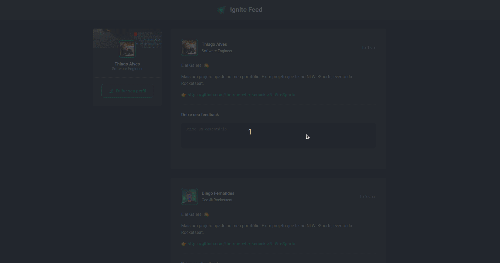

# Ignite Feed     
                                    
                 

      
    
    <h1>Ignite Feed</h1>

                
              

     
  <a href="#-tecnologias">Tecnologias</a>&nbsp;&nbsp;&nbsp;|&nbsp;&nbsp;&nbsp;  
  <a href="#-projeto">Projeto</a>&nbsp;&nbsp;&nbsp;|&nbsp;&nbsp;&nbsp;  
    

                               
                                                                                    
                                                           
                
                      
   
## 💻 Projeto            
  
 
✏️ O Ignite Feed é um projeto simples no qual você pode enviar feedbacks nas postagens. O projeto foi desenvolvido pela Rocketseat 🚀 para praticarmos os conseitos de estados, propriedades e componentes do react. 

  
 
 
          

  

 

 

