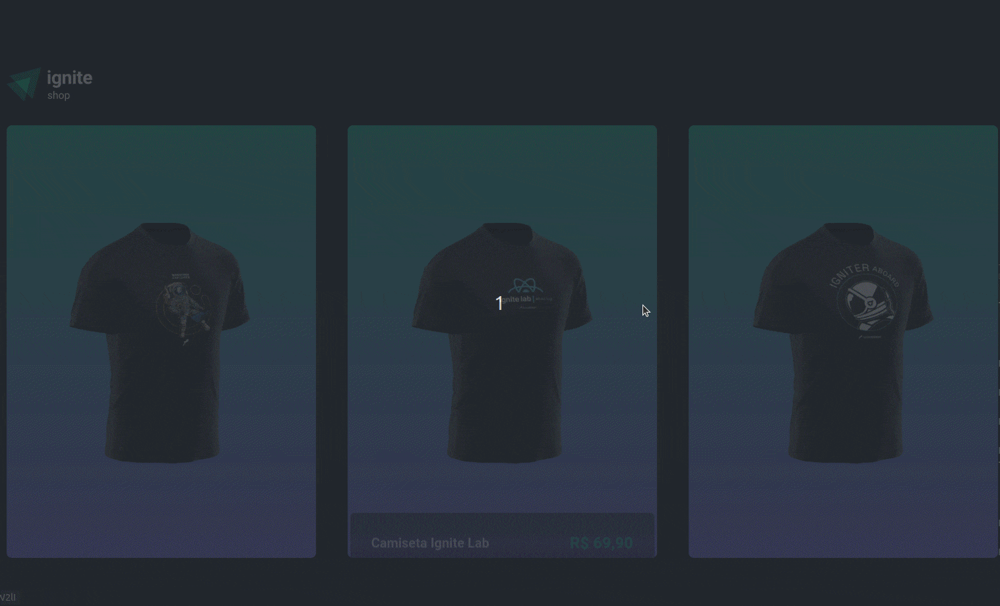

<div align='center'>
  
</div>

<div align='center'>
  
</div>


<br/>

 # 💻 Projeto
 
A aplicação faz parte do quarto projeto do Ignite. O Ignite Shop é uma aplicação desenvolvida utilizando NextJS onde você pode escolher camisetas temáticas da rocketseat e realizar o checkout do produto.


 ## Foram usadas as seguintes tecnologias:

- [NextJs](https://nextjs.org/);
- [ReactJS](https://pt-br.reactjs.org/);
- [Typescript](https://www.typescriptlang.org/);
- [Stiches](https://stitches.dev/);


## Para executar o projeto:

Clone o projeto e acesse a pasta aulas/igcoffee-delivery

```bash
$ git clone https://github.com/the-one-who-knoccks/Ignite-ReactJs.git
$ cd Ignite-ReactJs/aulas/04-ignite-shop
```
Para iniciá-lo, siga os passos abaixo:
```bash
# Instalar as dependências
$ npm install

# Iniciar o projeto
$ npm run dev
```
A aplicação será iniciada no endereço http://localhost:3000.


