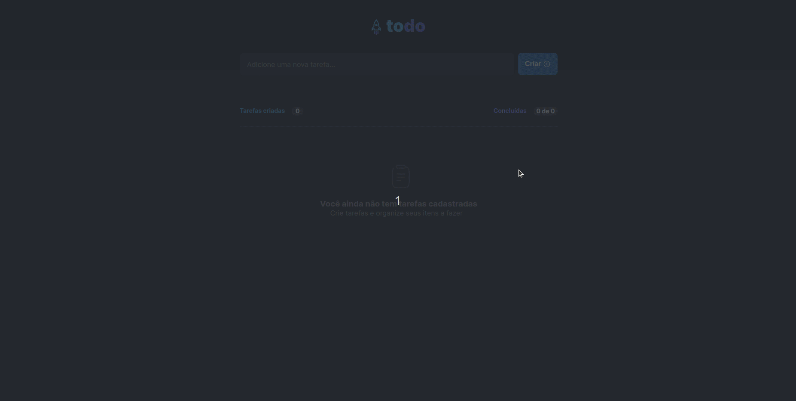

<p align="center">
</p>

<br>

Repositório com as aulas e desafios do Ignite.


  - [Descrição](#descrição)
  - [Ferramentas](#ferramentas)


## Descrição

Projeto desenvolvido como desafio do primeiro módulo.

<p align="center">
</p>


## Ferramentas

* [React](https://reactjs.org/)
* [Radix](https://www.radix-ui.com/)
* [Uuid](https://www.npmjs.com/package/uuid)
* [Figma](https://www.figma.com/)


## Para executar o projeto:

Clone o projeto e acesse a pasta aulas/igcoffee-delivery

```bash
$ git clone https://github.com/the-one-who-knoccks/Ignite-ReactJs.git
$ cd Ignite-ReactJs/aulas/desafio-ignite-todo
```
Para iniciá-lo, siga os passos abaixo:
```bash
# Instalar as dependências
$ npm install

# Iniciar o projeto
$ npm run dev
```
A aplicação será iniciada no endereço http://localhost:3000.


